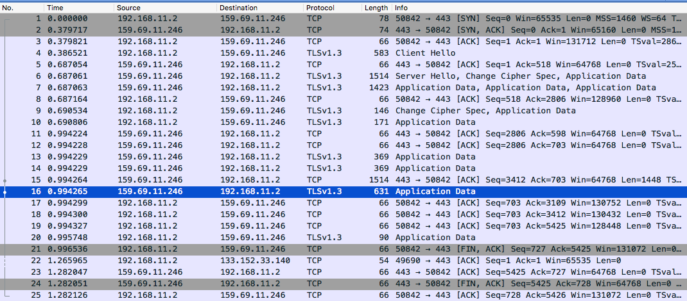
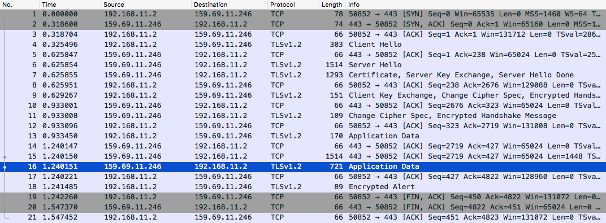

## はじめに

インターネットの前身であるARPANETが設計された当時はネットに接続する人は大学関係者と限られていたので、性善説に基づいて通信路を暗号化する必要はありませんでした。しかし、誰もがインターネットに参加する現代では、悪意のある人やプロバイダが飛び交うパケットを捕らえて通信内容を調べるかもしれません (郵便はがきと同じです)。実際にNSAはPRISMによる広域盗聴をし、XKeyscoreで解析をすることで個人情報の収集をしていました。通信内容から個人情報やパスワード、クレジットカード番号などを収集されては、安心してインターネットを利用することはできません。
この問題をトランスポート層で解決するのがTLS (Transport Layer Security) です。

### TLS

TLS は2者間の通信を安全にするためのものです。
ここでいう安全というのは、次の特性を持ちます。

- 真正性 : 通信相手や情報が本物で確かである特性 (サーバ証明書などによる証明)
- 機密性 : 権限を持つ人だけが通信内容にアクセスできる特性 (通信内容の暗号化)
- 完全性 : 改竄されることなく正確な状態を保つ特性 (ハッシュによる改ざん検知)

### TLS 1.2との違い

TLS 1.3はTLS 1.2と比較したときの主な変更点には、次のようなものがあります。

- 暗号アルゴリズムの選別 : **認証付き暗号(AEAD)**だけが使えるようになりました。これにより、互換性用の安全でないアルゴリズムが削除され、暗号文の改ざんが検知可能となりました。
- **前方秘匿性**の徹底 : セッション鍵を通信毎に破棄します。セッション鍵を使い回すことは、秘密鍵が漏れたときに過去の全ての通信が復号できることになりかねません。
- プロトコルの改良 : ハンドシェイクの往復回数が 2-RTT から 1-RTT に減少しました。これにより通信が高速化されます。他にも、ClientHelloとServerHelloで鍵共有した後のハンドシェイクは全て暗号化するようになりました。これによりサーバ証明書の送信データも暗号化されるようになります。

### OpenSSL v1.1.1

OpenSSL は TLS クライアントとしても使うことができます。
まずは OpenSSL のバージョンを確認しましょう。
コマンドで `openssl version` と入力して「OpenSSL 1.1.1」と表示されれば TLS 1.3 が使えます。
それ以下のバージョンだと TLS 1.2 までしか使えません。GitHubの[openssl](https://github.com/openssl/openssl)のページにアクセスしてダウンロードすることもできますが、最新のレポジトリは必ず動くという保証はないので、opensslの[releases](https://github.com/openssl/openssl/releases)から1.1.1以上の最新のバージョンをダウンロードします。
ここでは OpenSSL_1_1_1c をインストールする例をやりますが、必要に応じてバージョンを置き換えながら読んでください。

ソースのダウンロードと展開：

```
wget https://github.com/openssl/openssl/archive/OpenSSL_1_1_1c.zip
unzip OpenSSL_1_1_1c.zip
cd openssl-OpenSSL_1_1_1c
```

ビルドディレクトリの作成と ./config による Makefile の作成：

```
mkdir build && cd build
../config --prefix=$HOME/local -DSSL_DEBUG
make -j4
make install_runtime install_dev
```

./config のオプションについて

1. --prefix : インストール先を指定します。`--prefix=$HOME/local` と指定すればコマンドは $HOME/local/bin/openssl に置かれます。
2. -D : `-DSSL_DEBUG` で SSL_DEBUG というマクロを定義します。これを有効にするとデバッグモードで openssl が実行されます。openssl の動作を調査するときに役に立つので有効にしておきましょう。

make でオプション -j4 を付けると4並列でコンパイルするようになるので、高速化することができます。
make install ではなく make install_runtime install_dev をしているのはドキュメントはインストールしないようにして早く終わらせるためです。
インストールが終わったら、さっそく実行してみましょう。
https://tls13.pinterjann.is/ は TLS 1.3 に対応しているサイトなので、ここにアクセスしてみます。

```
~/local/bin/openssl s_client -connect tls13.pinterjann.is:443 -tls1_3
```

オプションについて

1. s_client : SSL/TLSのクライアントとして動作します。
2. -connect : 接続先のホストとポートを指定します。
3. -tls1_3 : TLS 1.3 で接続します。

実行すると、送受信したバイト列が16進で流れてきます。
TLS 1.3の通信が確立すると流れが止まって、入力待ちになるので、HTTPプロトコルで挨拶しましょう。
試しに `GET / HTTP/1.0` と入力して2回Enterを押すと、サーバから応答がHTMLで返ってきます。

```
GET / HTTP/1.0

HTTP/1.1 200 OK
Server: nginx/1.16.0
Content-Type: text/html; charset=utf-8
Content-Length: 1585
Content-Security-Policy: default-src 'none'; style-src 'unsafe-inline'
Strict-Transport-Security: max-age=31536000

<!DOCTYPE html>...
<p class="title">Congratulations! You're connected using <span class="green">TLSv1.3</span>!</p>...
```

Congratulations! You're connected using TLSv1.3! という文字列がHTMLの中にあれば成功です！

### curl 7.52.0

次に TLS 1.3で通信ができる curl も用意します。
curl は 7.52.0 以上であることに加えて、コンパイル時に TLS 1.3 対応の SSL を指定しないと TLS 1.3 で通信できません。
curl の最新バージョンは [curl/Download](https://curl.haxx.se/download.html) で確認できるので必要に応じて最新バージョンに置き換えてください。

```
wget https://curl.haxx.se/download/curl-7.65.3.zip
unzip curl-7.65.3.zip
cd curl-7.65.3
./configure --prefix=$HOME/local --with-ssl=$HOME/local
make -j4
make install-exec
```

./config のオプションについて

1. --prefix : インストール先を指定します。`--prefix=$HOME/local` と指定すればコマンドは $HOME/local/bin/curl に置かれます。
2. --with-ssl : 使用する SSL がある場所を指定します。ここで TLS 1.3 対応の SSL を使います。

インストールできたら実行してみます。-v を付けると詳細が表示されるので TLS 1.3 で通信しているか確認できます。

```
~/local/bin/curl -v --tlsv1.3 https://tls13.pinterjann.is
```

出力の中に「SSL connection using TLSv1.3」という文字列があれば、TLS 1.3で接続されていることが確認できます。


### WiresharkでTLS 1.3を観察する

openssl や curl が TLS 1.3 で通信できるようになったので、Wireshark でパケットを見てみます。
ここでは2種類のハンドシェイクが現れます。「TCPのハンドシェイク」と「TLSのハンドシェイク」です。
TCPのパケットは右側に `[SYN]`, `[SYN,ACK]`, `[ACK]`, `[FIN]`, `[FIN,ACK]` と書かれています。
TCPの3ウェイハンドシェイクとしてはコネクション開始時の SYN, SYN+ACK, ACK や終了時の FIN, FIN+ACK, ACK があります。
一方、TLSのパケットは `Client Hello`, `Server Hello`, `Application Data` などと書かれています。
TLSの手順は ClientHello と ServerHello で公開鍵暗号による鍵共有をして、ApplicationData でメッセージを暗号化するという流れです。
レイヤー的にはTCPの上の層にTLSがあるので、TLSのパケットを送ると、正しく受け取ったことをTCPのACKで返してくれます。
なので、TLSよりもTCPのパケットが一杯流れるということを知っておいてください。

では実際にTLSのパケットを捕まえてみます。
まずは Wireshark を起動して、Wi-Fi のインターフェイスを選択します。
様々なパケットが流れているので、設定(歯車のアイコン)のキャプチャフィルタで `tcp port https` とすれば、HTTPSの通信だけにすることができます。
パケットキャプチャしている状態で curl コマンドを入力します。

curl の TLS 1.3 で通信するとき：

```
~/local/bin/curl -v --tlsv1.3 https://tls13.pinterjann.is
```



curl の TLS 1.2 で通信するとき：

```
~/local/bin/curl -v --tls-max 1.2 https://tls13.pinterjann.is
```



サーバがクライアントに送るパケットでHTMLを渡していると思われるパケットを青色にしました。
両者を比較すると TLS 1.3 の方が 0.2秒ほど早くレスポンスが返ってきています。
他にも TLS 1.2 では Certificate (証明書を送るパケット) が見えますが、TLS 1.3では暗号化されているので Application Data (暗号化データを送るパケット) しか見えません。
これらはTLS 1.3でのプロトコルの改善によるものです。
